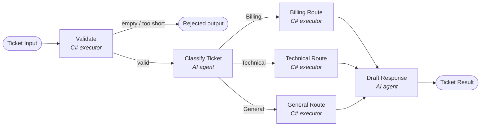

# AgentWorkflowAITicketSupport

A small .NET console app that triages customer support tickets with a **Microsoft Agent Framework workflow**.
Deterministic C# executors validate and route each ticket, and two AI agents (OpenAI) classify it and draft a reply.

The AI only *labels* the ticket. The workflow's conditional edges decide which branch runs, so the routing stays predictable.

## Workflow



| Step | Executor | Type | What it does |
|---|---|---|---|
| 1 | Ticket Input | Console | Reads a support message |
| 2 | `Validate` | C# | Rejects empty or very short tickets (< 10 chars) without calling any AI |
| 3 | `Classify` | AI agent | Returns `Billing`, `Technical` or `General` plus a one-sentence summary (structured output) |
| 4 | Conditional edges | Workflow | Sends the ticket to exactly one route based on the category |
| 5 | `BillingRoute` / `TechnicalRoute` / `GeneralRoute` | C# | Attaches the assigned team and a handling instruction |
| 6 | `DraftResponse` | AI agent | Writes a concise customer-facing reply |
| 7 | Final Result | Output | Prints category, assigned team, summary and draft reply |

## Project structure

```
Program.cs                      Configuration, agents, workflow graph, console loop
Models.cs                       SupportTicket, TicketClassification, ClassifiedTicket, RoutedTicket, TicketResult
Executors/
  ValidateExecutor.cs           Validation gate (starting node)
  ClassifyExecutor.cs           Wraps the TicketClassifier agent
  RouteExecutor.cs              One class, three route instances
  DraftResponseExecutor.cs      Wraps the ResponseWriter agent and yields the final result
```

## Requirements

- .NET 10 SDK
- An OpenAI API key

## Setup

The API key is stored with .NET User Secrets, outside the repository:

```
dotnet user-secrets set "OpenAI:ApiKey" "sk-..."
dotnet user-secrets set "OpenAI:Model" "gpt-4o-mini"   # optional, gpt-4o-mini is the default
```

Environment variables (`OpenAI__ApiKey`, `OpenAI__Model`) also work and override User Secrets.

## Run

```
dotnet run
```

Type a ticket and press Enter. Type `exit` to quit.

## Sample run

```
Ticket> I was charged twice this month.
  ✓ Validate
  ✓ Classify
  ✓ BillingRoute
  ✓ DraftResponse

=== Ticket Result ===
Category:      Billing
Assigned team: Billing Team
Summary:       The customer reports being charged twice within the same month.
Draft reply:
Thank you for bringing this to our attention. Our Billing Team is currently reviewing your account to verify the charges. They will reach out to you shortly to provide an update and address any eligible refunds. We appreciate your patience in this matter.

Ticket>
  ✓ Validate

Rejected: ticket is empty.
```

## Acceptance tests

| Input | Expected | Result |
|---|---|---|
| "I was charged twice this month." | Billing → Billing Team | ✅ |
| "The app crashes whenever I upload a PDF." | Technical → Engineering Support | ✅ |
| "Do you offer discounts for universities?" | General → Customer Success | ✅ |
| *(empty input)* | Rejected, classifier not called | ✅ |

## Built with

- [Microsoft Agent Framework](https://github.com/microsoft/agent-framework) (`Microsoft.Agents.AI.Workflows`, `Microsoft.Agents.AI.OpenAI`)
- OpenAI chat models

## License

MIT
